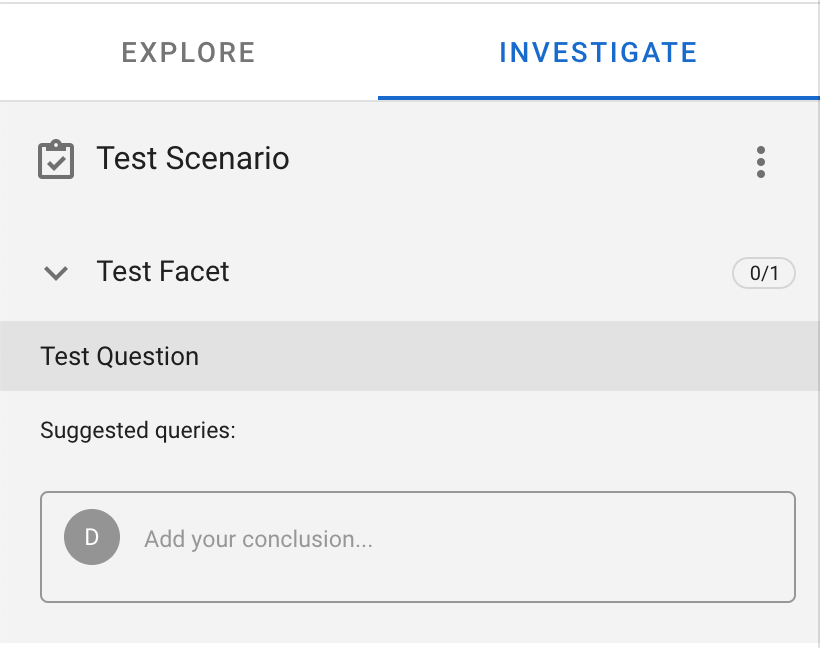

---
hide:
  - footer
---
# DFIQ

The Digital Forensics Investigation Question feature allows for centrally storing and maintaining investigative steps commonly used for an easy analyst workflow.

## How-To configure

The DFIQ feature is configured in a yaml file that needs to be added to the [timesketch.conf](https://github.com/google/timesketch/blob/master/data/timesketch.conf) file. Add the path to the yaml config file in the `DFIQ_PATH` variable.

```
# DFIQ - Digital Forensics Investigation Questions
DFIQ_PATH = '/etc/timesketch/dfiq/'
```

### Test scenarios

Timesketch comes with a small set of test scenarios in [test_data/dfiq](https://github.com/google/timesketch/tree/master/test_data/dfiq) that can be used to verify the functionality works. To use it in docker you can either copy over the contents of the folder to `/etc/timesketch/dfiq` (or any other folder configured in `timesketch.conf`) or creaty a symbolic link like `ln -s /usr/local/src/timesketch/test_data/dfiq/ /etc/timesketch/`. After restarting the frontend docker instance, the scenarios will be visible in the UI.



## Troubleshooting

In general, look at [Troubleshooting Guide for Timesketch](./troubleshooting.md)

* Do you have an entry in your `/etc/timesketch/timesketch.conf` file with `DFIQ_PATH`?
* What is the output of `grep "DFIQ_PATH" /etc/timesketch/timesketch.conf`?
* Does the folder referenced in the `timesketch.conf` file exist and is reachable for the frontend of Timesketch?
* If you added own scenarios, facets, questions - check if they are valid YAML
* Provide error messages in places outlined in [Troubleshooting Guide for Timesketch](./troubleshooting.md) and open a Github issue, if possible providing the scenario contents you are trying to add.